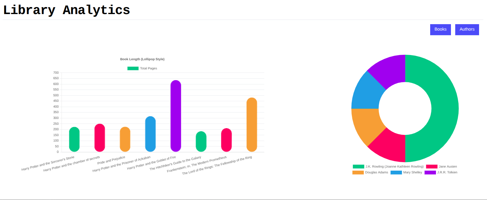

# FULL STACK APP  ON-PREM
This project is a full-stack web application built using React js for the frontend, Express js for the backend, and MySQL as the database. The application is designed to demonstrate the implementation of a 3-tier architecture, where the presentation layer (React js), application logic layer (Express js), and data layer (MySQL) are separated into distinct services all running on on-premise servers.


## User Interface Screenshots 
#### Home Page


#### Books


#### Authors


## Creatin the Services

We are going to create all 3 services in this flow:

```scss
Browser (React UI)
      ↓
Backend API (Node/Express)
      ↓
MySQL database
```


## Setting up the Database service
#### Install MySQL
We will run the following commands to install MySQL database:

```sql

================ DATABASE SETUP – COMMAND SHEET ===================

DATABASE ENGINE

MySQL
Default port: 3306

---------------------------------------------------------------------

1) START MYSQL SERVICE

sudo systemctl start mysql

Check status:

sudo systemctl status mysql

---------------------------------------------------------------------

2) LOGIN TO MYSQL

mysql -u root -p

---------------------------------------------------------------------

3) CREATE DATABASE

Inside MySQL:

CREATE DATABASE react_node_app;
EXIT;

---------------------------------------------------------------------

4) IMPORT SCHEMA

From project root:

mysql -u root -p react_node_app < backend/db.sql

---------------------------------------------------------------------

5) TEST DATABASE

mysql -u root -p

USE react_node_app;
SHOW TABLES;
SELECT * FROM author;

---------------------------------------------------------------------

6) STOP MYSQL

sudo systemctl stop mysql

=====================================================================
```

## Setting up the Backend or Application service
```sql
================ BACKEND CREATION – COMMAND SHEET ================

PROJECT STRUCTURE

project-root/
 ├── backend/
 └── frontend/

---------------------------------------------------------------------

1) CREATE BACKEND FOLDER

mkdir backend
cd backend

---------------------------------------------------------------------

2) INIT NODE PROJECT

npm init -y

---------------------------------------------------------------------

3) INSTALL DEPENDENCIES

npm install express mysql2 cors body-parser dotenv

Optional dev tools:
npm install --save-dev nodemon

---------------------------------------------------------------------

4) CREATE BACKEND FILES

backend/
 ├── server.js
 ├── app.js
 ├── configs/db.js
 ├── routes/index.js
 ├── controllers/
 └── utils/logger.js

---------------------------------------------------------------------

5) DATABASE CONNECTION CONFIG

File: configs/db.js

Environment variables used:

DB_HOST
DB_PORT
DB_USER
DB_PASSWORD
DB_NAME

Fallback defaults:
localhost / 3306 / root / password / react_node_app

---------------------------------------------------------------------

6) OPTIONAL ENV FILE

backend/.env

PORT=3000
DB_HOST=localhost
DB_USER=root
DB_PASSWORD=12345678
DB_NAME=react_node_app

---------------------------------------------------------------------

7) START BACKEND

cd backend
node server.js

Expected output:

Backend server running on port 3000
Connected to MySQL Database

---------------------------------------------------------------------

8) TEST BACKEND

curl http://localhost:3000/health
curl http://localhost:3000/api/authors

---------------------------------------------------------------------

STOP BACKEND

Ctrl + C

=====================================================================


```
## Setting up the Frontend or Presentation service

```bash
================ FRONTEND CREATION – COMMAND SHEET ================

PROJECT STRUCTURE

project-root/
 ├── backend/
 └── frontend/

---------------------------------------------------------------------

1) CREATE FRONTEND (VITE + REACT + TS)

cd project-root

npm create vite@latest frontend

Select:
React
TypeScript

cd frontend

---------------------------------------------------------------------

2) INSTALL DEPENDENCIES

npm install

Extra libraries used in project:

npm install antd react-router-dom chart.js react-chartjs-2

Tailwind (if used):
npm install -D tailwindcss postcss autoprefixer
npx tailwindcss init -p

---------------------------------------------------------------------

3) ENVIRONMENT CONFIG

File: frontend/.env

VITE_API_URL=http://localhost:3000/api

Important:
Vite only reads env on startup
Restart dev server after editing

---------------------------------------------------------------------

4) START FRONTEND DEV SERVER

cd frontend
npm run dev

Frontend URL:

http://localhost:5173

---------------------------------------------------------------------

5) FRONTEND → BACKEND CONNECTION

Inside React:

const API_URL = import.meta.env.VITE_API_URL;

fetch(`${API_URL}/books`)
fetch(`${API_URL}/authors`)

---------------------------------------------------------------------

6) BUILD FOR PRODUCTION

npm run build

Output folder:

frontend/dist/

This folder can be served by nginx or backend

---------------------------------------------------------------------

7) DEBUG COMMANDS

Check frontend running:

ss -tulnp | grep 5173

Stop frontend:

Ctrl + C

Restart frontend:

npm run dev

---------------------------------------------------------------------

FRONTEND DATA FLOW

Browser
  ↓
localhost:5173 (Vite UI)
  ↓ fetch()
localhost:3000/api (Backend API)

=====================================================================

``` 

## Starting up the App

		================ FULL STACK APP – ONPREM START STEPS ================

ARCHITECTURE
Browser → Frontend(5173) → Backend(3000) → MySQL(3306)

---------------------------------------------------------------------

1) START DATABASE

sudo systemctl start mysql
sudo systemctl status mysql

---------------------------------------------------------------------

2) START BACKEND API

cd backend
node server.js

Expected:
Backend server running on port 3000
Connected to MySQL Database

Test backend:
curl http://localhost:3000/health
curl http://localhost:3000/api/authors

Backend URL:
http://localhost:3000

---------------------------------------------------------------------

3) START FRONTEND UI

cd frontend
npm run dev

Frontend URL:
http://localhost:5173

---------------------------------------------------------------------

FRONTEND ENV FILE

File: frontend/.env

VITE_API_URL=http://localhost:3000/api

(Frontend must be restarted after editing .env)

---------------------------------------------------------------------

DATABASE INFO

MySQL port: 3306
Database name: react_node_app
Schema file: backend/db.sql

Login:
mysql -u root -p

---------------------------------------------------------------------

DEBUG COMMANDS

Check backend listening:
ss -tulnp | grep 3000

Test API:
curl http://localhost:3000/api/books

---------------------------------------------------------------------

STOP SERVICES

Frontend: Ctrl+C
Backend:  Ctrl+C
MySQL:    sudo systemctl stop mysql

---------------------------------------------------------------------

START ORDER

MySQL → Backend → Frontend

=====================================================================
